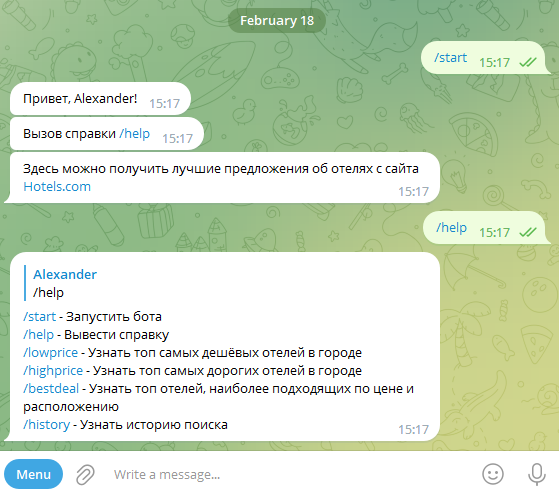
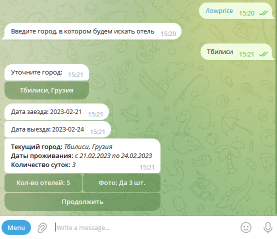
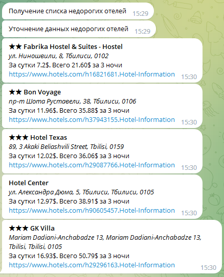
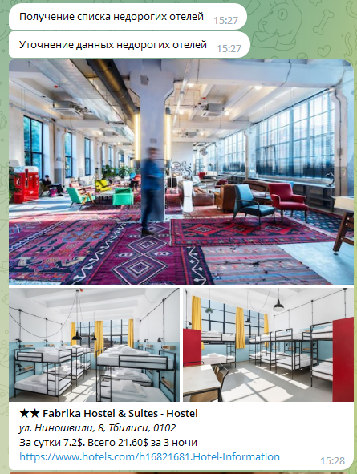
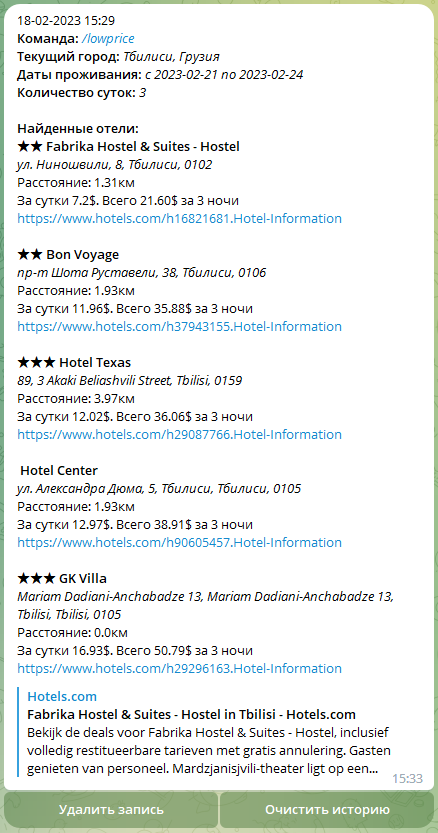

Телеграмм бот по поиску отелей
==============================

Основные функции
----------------

* Поиск отелей в заданном городе
* Вывод самих дорогих, дешевых отелей, либо находящихся не дальше заданного расстояния
* Настройка параметров вывода:
  * количества отелей
  * выводить или нет фотографии и их количество
* Сохранение истории поиска
* Расчет стоимости проживания по указанным датам

**_Источник информации для бота - API сайта [Hotels.com](https://www.hotels.com/)_**

Инструкция по установке и первому запуску 
-----------------------------------------
### Установка обычным способом:

1. Скопировать файлы проекта в локальную директорию

2. Установить зависимости из requirements.txt:
```commandline
pip install -r requirements.txt
```
*Рекомендуется настроить [виртуальное окружение](https://docs.python.org/3/library/venv.html).*

3. Получить ключ для работы с API
   1. Зарегистрироваться на сайте [rapidapi.com](https://rapidapi.com)
   2. Оформить подписку на [API Hotels](https://rapidapi.com/apidojo/api/hotels4/)   

4. Создать нового бота и получить токен для работы с ним.  
    1. Найти в приложении telegram нужно бота [BotFather](https://t.me/botfather)
    2. Создать нового бота командой `/newbot`
    3. Выполнить несколько простых шагов  
[Руководство](https://core.telegram.org/bots#6-botfather) 

5. Переименовать файл `.env.template` в `.env`, указать в нем свой токен для бота и ключ от Rapid API  
Пример файла `.env`:
```dotenv
BOT_TOKEN = "5979225464:AAGiCcigsNhz8UcT8ec6XeYAye5e......."
RAPID_API_KEY = "475c810feamshdf274c2e9c5dd05p1ca858jsn4db29......."
```

6. Запустить программу
```commandline
python main.py или python3 main.py 
```

### Установка через docker:
Необходимо скопировать все содержимое репозитария в отдельный каталог.
Файл `.env.template` переименуйте в `.env`. Откройте его и заполните необходимыми данными.
Запустите вашего бота командой `docker-compose up -d`.


Работа с телеграмм ботом
------------------------
### Начало работы
Для начала работы отправьте боту команду `/start` и для получения списка доступных команд отправьте команду `/help`

### Поиск отелей
После ввода требуемой команды введите город, в котором необходимо найти отель, уточните даты проживания.  




Нажатием на кнопку **Кол-во отелей** можно последовательно изменить количество выводимых отелей *5->10->15...5*.  
Кнопка **Фото** переключает режим вывода фотографий.

### Пример ответа телеграм бота.  
**Город:**  Тбилиси, Грузия  
**Отели:** недорогие




### История поиска
Чтобы просмотреть историю поиска, отправьте боту команду `/history`
При помощи кнопок **Удалить запись** и **Очистить историю** возможно удалить один запрос или очистить всё историю.


Настройки бота
--------------

В файле `config_data/config.py` находятся настройки для бота.

```dotenv
NUMBER_OF_FOTO = 3      # количество выводимых фото (со скольки начинается)
NUMBER_OF_HOTELS = 5    # количество выводимых отелей по умолчанию
LEVEL_DEBUG = 'DEBUG'   # режим отладочных сообщений - DEBUG, INFO
```
